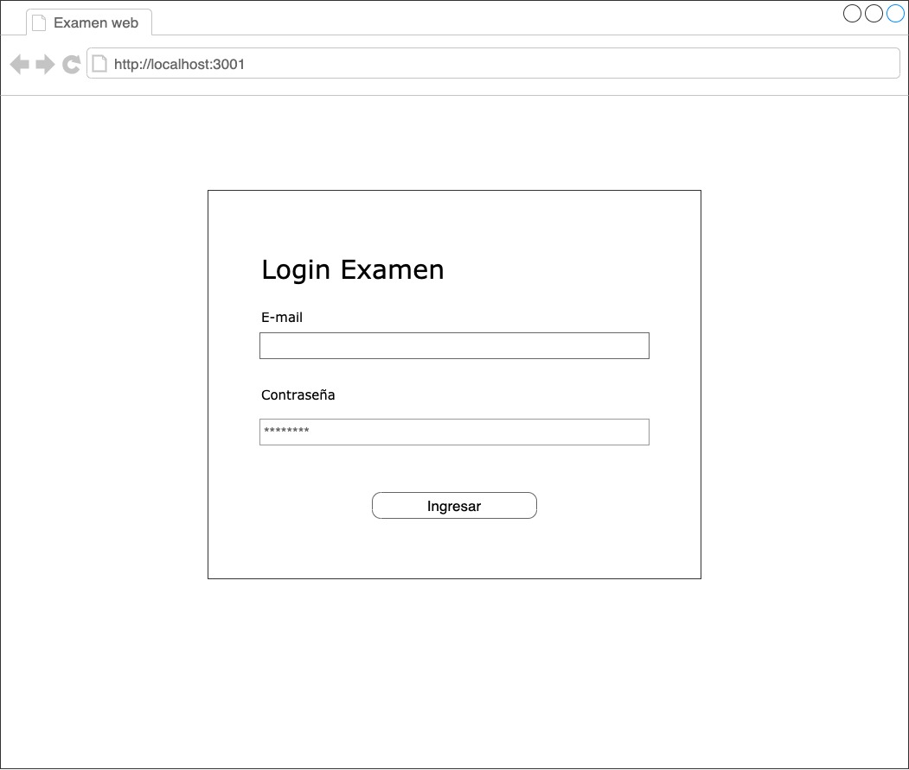
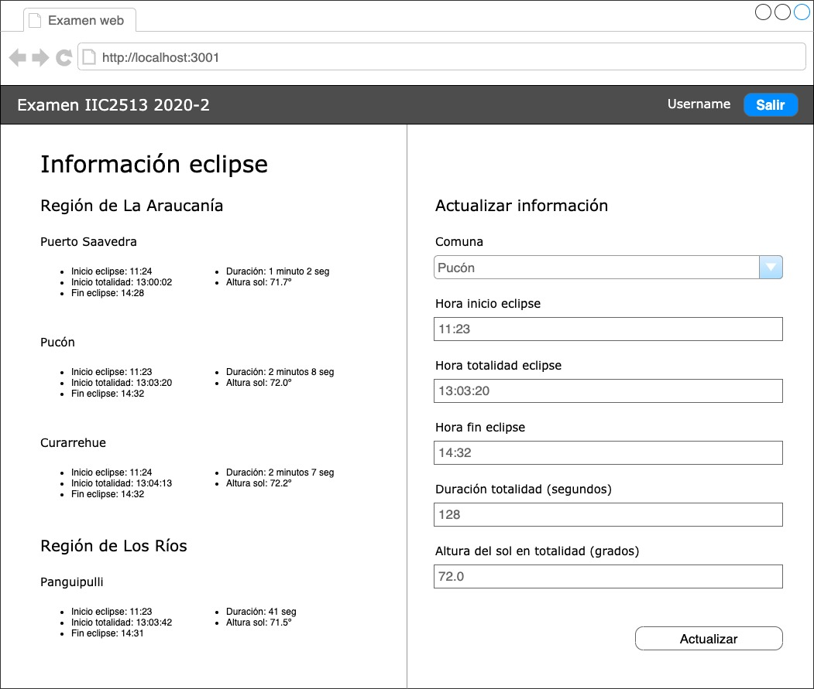

# Examen IIC2513 sección 1 2020/2
> **Forma 3**
>
> **Plazo de entrega: 14 de diciembre de 2020 hasta las 23:59 hrs**

## Contexto

En Chile estamos en temporada de eclipses. Si aún no lo sabes, hoy 14 de diciembre ¡tendremos un eclipse solar en el país! Si bien este evento astronómico podrá ser apreciado en la mayor parte del territorio de forma parcial, en las regiones de La Araucanía y Los Ríos será un eclipse solar total, es decir, la luna cubrirá completamente el sol, haciéndose de noche a eso de las 13:00 hrs por un período corto de tiempo (30 segundos a 2 minutos, dependiendo del lugar). Puedes ver las comunas y sectores en las que se vivirá la totalidad del eclipse en el siguiente esquema


Fuente: [Araucanía eclipse](https://araucaniaeclipse.com/wp-content/uploads/2020/10/mapa2020.svg)

En preparación para este evento, las autoridades de las regiones de La Araucanía y Los Ríos te han encomendado la tarea de crear una pequeña plataforma web que permita manejar información respecto al eclipse en la zona. Si bien la totalidad se verá en varias comunas, la duración será diferente según la latitud en la que el observador se encuentre. No es lo mismo estar en el extremo norte o sur de la zona de umbra (donde puede llegar a durar tan solo unos pocos segundos) a estar en la zona cero (donde alcanzará 2 minutos y 9 segundos).

Preocupados de brindar a los interesados toda la información pertinente a la duración de la totalidad por comuna (y otros aspectos relevantes), de manera que se puedan planificar, las autoridades te han encargado la parte de la plataforma que se hace cargo de la actualización de esta información. Tendrás que implementar una pequeña interfaz web en React que consuma una API REST, y que permita visualizar la información de horarios del eclipse, en cada comuna que estará en la zona de la totalidad.

Un punto importante que debes considerar es que esta aplicación no estará disponible para el público, sino que será sólo de uso interno de las autoridades. Por lo tanto, incluirá manejo de sesión para que sólo usuarios registrados puedan modificar la información pertinente.

Para realizar tu trabajo, seguirás un approach progresivo, donde primero crearás la interfaz en los lenguajes que entiende el browser (HTML y CSS), luego implementarás algunos endpoints de una API existente, y finalmente conectarás la interfaz con la API utilizando React en el cliente. 

Tendrás que clonar y modificar dos proyectos cuyos links se encuentran a continuación:

- [examen-frontend](https://github.com/IIC2513-2020-2/examen-frontend)
- [examen-backend](https://github.com/IIC2513-2020-2/examen-backend)

En cada uno de los repositorios encontrarás instrucciones para ejecutarlos. Parte de estos proyectos es lo que deberás subir para entregar tu examen.

## Parte I: HTML + CSS (2.0 pts)

En esta primera parte tendrás que implementar dos documentos HTML **estáticos**. Para esto tendrás disponibles wireframes en los cuales te debes basar para el estilo y disposición de elementos. Las páginas a implementar son dos: login de usuario y contenido principal.

### Login de usuario

El primer documento HTML corresponde al login de usuario. Como fue mencionado, la aplicación será de uso interno de las autoridades, por lo que requiere que los usuarios inicien sesión antes de poder realizar alguna acción.

El wireframe en el que te debes basar es el siguiente:



Para esta parte utilizarás el proyecto `examen-frontend`. Debes asegurarte de clonarlo y ejecutarlo como indican las instrucciones del repositorio.

El archivo que debes modificar con el código HTML ya existe y se encuentra en la ruta `src/static/login.html`. Este archivo ya tiene una estructura base y referencias a archivos CSS existentes. Puedes modificar esas hojas de estilo o agregar una nueva que puedas referenciar desde el HTML. Para visualizar tu resultado basta con que abras este archivo directamente en el browser (pues es estático).

Debes tener en cuenta las siguientes consideraciones y restricciones:

- El formulario debe estar centrado **tanto horizontal como verticalmente**, pero para tamaños menores a 501px debe ocupar todo el ancho de la pantalla (puedes incluir un pequeño padding o margin si gustas)
- No importa hacia dónde haga submit el formulario. Podrías incluso omitir el atributo que especifca esto
- **DEBES** utilizar el archivo existente. No se aceptarán respuestas en otros archivos diferentes a `login.html`

### Contenido principal

El segundo documento HTML a implementar corresponde al contenido principal, que en este caso es la visualización y actualización de horarios del eclipse por comunas.

El layout consta de dos columnas, una para visualizar información por comuna y otra para actualizar información de los horarios del eclipse en una comuna en particular. El wireframe en el que te debes basar es el siguiente:



Para esta parte también utilizarás el proyecto `examen-frontend`. El archivo que debes modificar con el código HTML ya existe y se encuentra en la ruta `src/static/content.html`. Este archivo ya tiene una estructura base (que incluye el header) y referencias a archivos CSS existentes. Del mismo modo que para la página anterior, puedes modificar esas hojas de estilo o agregar una nueva y referenciarla desde el HTML.

Debes tener en cuenta las siguientes consideraciones y restricciones:

- El wireframe muestra unas pocas comunas para cada región. Puedes ingresar esas comunas tal cual aparecen en el wireframe o agregar nuevas si quieres probar tu implementación con más datos. Ten en consideración, eso sí, que agregar más datos no debe significar cambios en el CSS (es decir, deberíamos poder agregar arbitrariamente más comunas y que el estilo siga respetándose)
- La lista de información dentro de cada comuna en el wireframe tiene 5 entradas con datos. Siempre se mostrarán esas 5 opciones
- Para el selector de comuna del formulario, puedes incluir sólo las 4 comunas que aparecen en el wireframe. Considera que cada opción debe tener algún tipo de identificador en el atributo `name` (elige el que quieras)
- Los campos de horas (inicio eclipse, totalidad y fin eclipse) son campos de texto (a pesar de ser horas, no nos preocuparemos mayormente del ingreso de datos en estos campos)
- El input duración de la totalidad debe ser numérico y estar en un rango entre 1 y 130 (está expresado en segundos y sabemos que este eclipse no durará más que eso)
- El layout del wireframe considera 2 columnas. Para tamaños de pantalla menores a 501px, debe desplegarse como una sola columna, y debe mostrar primero el formulario y luego la visualización de comunas
- Como el alto de la columna con la lista de comunas muy probablemente sea más grande que el del formulario, se generará un scroll. No importa que al hacer scroll el formulario quede "arriba" y no visible
- **DEBES** utilizar el archivo existente. No se aceptarán respuestas en otros archivos diferentes a `content.html`

### Consideraciones generales para ambas páginas

- Debes escribir estilos en CSS. **NO DEBES** escribir estilos inline (atributo `style`). Se aplicará un descuento si el documento HTML incluye este tipo de atributos
- Haz un buen uso de clases en CSS para poder reutilizar estilos
- Los tamaños específicos de letra y márgenes quedan a criterio tuyo, sin embargo, el resultado final debe verse similar al wireframe (no debes, por ejemplo, centrar el título "Login Examen" si es que no aparece así en el wireframe)
- En cuanto a layout, puedes utilizar Flexbox, Grid o float. Queda a criterio tuyo, pero recuerda que floats está algo "obsoleto"
- Puedes elegir colores y tipografías a gusto si lo deseas, pero no será evaluado. Sin embargo, si incluyes estos elementos al nivel de definir una paleta de colores y tipografía coherentes, tendrás un **bonus por proactividad de 0.1 puntos**.

## Parte II: API (2.0 pts)

En esta parte del examen tendrás que implementar algunos endpoints de la API asociada a información del eclipse por comuna y/o sector dentro de la zona de totalidad del eclipse solar.

Utilizarás el proyecto `examen-backend`. Debes asegurarte de clonarlo y ejecutarlo como indican las instrucciones del repositorio (incluyendo la ejecución de seeds).

A continuación encontrarás los endpoints que incluye la API y también algunos que debes implementar.

### Autenticación usuarios

La API requiere que los usuarios inicien sesión antes de poder realizar alguna acción. El endpoint asociado a esto **ya está implementado**, mediante JSON Web Tokens (JWT), por lo que no debes modificar nada. Eso sí, es aconsejable que lo pruebes haciendo el request correspondiente. La especificación del endpoint es:

- Method: `POST`
- Path: `/api/auth`
- Content-Type: `application/json`
- Body parameters:
  ```json
  {
    "email": "user_email",
    "password": "user_password"
  }
  ```

- Response
    - Status code: `201`
    - Content-Type: `application/json`
    - Body:
        ```json
        {
          "id", // User ID
          "name", // User name
          "token" // JWT token
        }
        ```

- **IMPORTANTE**: no olvides agregar la variable de ambiente `JWT_SECRET` para que la generación del token funcione

[**UPDATE**] En las seeds del proyecto podrás encontrar usuarios ya registrados. Uno de esos usuarios tiene las siguientes credenciales:

```
E-email: user@example.org
Password: hola.123
```

### Listado de comunas e información del eclipse

Este endpoint entrega la información de las comunas y sectores dentro de la zona de totalidad del eclipse solar y, para cada una, información sobre el eclipse mismo (horarios en su mayoría). El endpoint está parcialmente implementado. De hecho, puedes hacer un request y obtendrás una respuesta. Sin embargo, esto no debería ser así pues no debiese ser de acceso público. Recuerda que esta API sólo será accedida por usuarios autenticados.

Tu tarea en esta parte del examen será "proteger" el endpoint para que sólo pueda ser accedido por usuarios que hayan iniciado sesión. Todo usuario que haya iniciado sesión tendrá disponible un JWT token (que se puede obtener del endpoint descrito en la sección anterior). Este endpoint requiere que se envíe el token de alguna forma al servidor como medida de seguridad. Se espera que utilices un middleware para proteger este endpoint.

La especificación del endpoint es:

- Method: `GET`
- Path: `/api/districts/eclipse-info`
- Response
    - Status code: `200`
    - Content-Type: `application/json`
    - Body:
      ```json
      [
        {
          "id", // District ID
          "name", // District name
          "region" // District region name
          "EclipseInfo": {
            "startTime", // Start time of the eclipse
            "totalityTime", // Start time of totality of the eclipse
            "endTime", // End time of the eclipse
            "duration", // Duration of the eclipse in seconds
            "altitude", // Sun altitude (in º)
          }
        },
        // Array with more objects like the above
      ]
      ```

En caso de no incluir información de autenticación o que esta sea inválida, el endpoint debe retornar un status code `401` (unauthorized). No es necesario que devuelvas un body específico.

### Actualizar información del eclipse de una comuna

El último endpoint, que sí tendrás que **implementar desde cero**, es el que permite actualizar la información del eclipse para una comuna en particular. Este endpoint también debe ser accesible sólo para usuarios autenticados (de hecho, la protección tiene especial énfasis en este caso, pues por medio de este endpoint ya es posible alterar la base de datos). Se espera que también lo hagas a través de un middleware (como el anterior).

Como es un endpoint que recibe información del eclipse para una comuna, debes entregar esta en formato JSON y además **validar** que todos los campos especificados en los body parameters no sean blancos, vacíos o nulos. Considera que podría suceder que sólo se quiera actualizar un campo solamente (no siempre todos a la vez).

La especificación del endpoint es:

- Method: `PATCH`
- Path: `/api/districts/:id/eclipse-info` (donde `:id` corresponde al ID de una comuna)
- Content-Type: `application/json`
- Body parameters:
  ```json
  {
    "startTime", // Start time of the eclipse
    "totalityTime", // Start time of totality of the eclipse
    "endTime", // End time of the eclipse
    "duration", // Duration of the eclipse in seconds
    "altitude", // Sun altitude (in º)
  }
  ```

- Response
    - Status code: `200`
    - Content-Type: `application/json`
    - Body:
        ```json
        {
          "id", // Eclipse info ID
          "startTime", // Start time of the eclipse
          "totalityTime", // Start time of totality of the eclipse
          "endTime", // End time of the eclipse
          "duration", // Duration of the eclipse in seconds
          "altitude", // Sun altitude (in º)
          "districtId", // District ID
        }
        ```

Para casos especiales en que el request no sea válido:

- Si autenticación falla, retornar status code `401` (el body no es relevante)
- Si request falla por validación, retornar status code `422` (el body no es relevante)
- No es necesario validar alguna lógica para que horarios tengan sentido (serán sólo texto), pero sí debes validar que la duración sea positiva y esté en el rango entre 1 y 130. Además debes exigir que los campos en el request body sean no vacíos

## Parte III: Componente en React e integración con API (2.0 pts)

Hasta este punto, ya debieses tener los endpoints necesarios de la API funcionando y, además, documentos HTML estáticos con estilos incorporados. Sólo faltaría integrar estas partes en una single-page application construida en React.

Para esta parte utilizarás el proyecto `examen-frontend` nuevamente. Debes asegurarte de que puedas acceder sin problemas al ingresar a [http://localhost:3001](http://localhost:3001) (que será la URL de tu SPA). Recuerda que debes ver una página con un header estático y el resto en blanco.

Debes implementar un componente raíz (que a su vez **debe** incorporar componentes hijos) que sigan cierta lógica descrita en las siguientes secciones.

### Login de usuario

Ya ha sido mencionado en varias oportunidades que la aplicación sólo podrá ser accedida por usuarios registrados (las autoridades de las comunas). Lo primero que deberás hacer es evaluar si el usuario inició sesión o no. Si no ha iniciado sesión, debes mostrar un formulario de login para el usuario.

Aquí es donde debes comenzar a interactuar con la API. Debes tenerla corriendo y, por lo tanto, disponible en [http://localhost:3000](http://localhost:3000) (puedes suponer que siempre utilizarás esa URL base).

Al hacer submit del formulario de login con las credenciales de usuario, debes enviar un request al endpoint de autenticación de la API . Aquí pueden suceder dos cosas dependiendo del response:

- Request fallido: mostrar un pequeño mensaje arriba del formulario con un error (queda a criterio tuyo el mensaje, pero intenta que sea genérico)
- Request exitoso: debes mostrar el contenido principal de la aplicación, explicado en la siguiente sección

En este punto es que debes utilizar el documento HTML estático con nombre `login.html` de la Parte I. Deberás "traducirlo" a un componente en React (incluyendo los estilos que ya habías agregado).

Debes tener en cuenta las siguientes consideraciones:

- El resultado de la Parte I debe ser igual a lo desplegado en este componente
- Debes guardar la información del response del endpoint de autenticación, pues tendrás que utilizarla en la siguiente sección. No es necesario que esta información quede persistida en el browser (está bien si refrescas la página y se pierde la sesión), por lo que basta con que utilices un state de componente.

### Contenido principal

Luego de iniciar sesión, ya es posible mostrar el contenido principal de la aplicación. Para esto debes utilizar el documento HTML estático con nombre `content.html` de la Parte I. Deberás "traducirlo" a varios componentes en React (incluyendo los estilos que ya habías agregado).

Naturalmente no dispones de la información necesaria (más que lo que implementaste en la versión estática), pero sí dispones de endpoints en la API para obtener esta información.

Lo primero que debes mostrar es el nombre del usuario en el header ya implementado. El texto que decía "Username" debe ser reemplazado por este nombre de usuario. Considera que deberías tener disponible esta información luego de haber llamado al endpoint de autenticación.

Además, debes implementar la lógica de logout al presionar el botón "Salir". Para esto, puedes utilizar el mismo criterio que te permitió decidir si mostrar o no el contenido principal en base a si el usuario había iniciado sesión (probablemente algún tipo de dato presente o ausente). Luego de presionar el botón, entonces, debe volver a mostrarse el formulario de login.

En segundo lugar, debes obtener la información de las comunas y sus respectivos horarios del eclipse utilizando el endpoint descrito en la Parte II. Como los requests toman un tiempo en responder, mientras la información se esté cargando debes mostrar un "loading" de alguna manera (puede ser sólo texto o algo más elaborado como un spinner, queda a criterio tuyo).

Recuerda además que este endpoint requiere autenticación, por lo que necesitas adjuntar el JWT token de alguna manera.

Una vez cargada la información, será posible remover el loading y desplegar todo el contenido siguiendo el formato del wireframe y documento estático que ya implementaste. La única restricción aquí es que debes mostrar la duración en el formato "X minutos Y seg" (si es menos de 1 minuto, sólo debes mostrar los segundos).

Por último debes implementar la lógica del formulario de actualización de información. En este caso, debes tener las siguientes consideraciones:

- El select de comuna debe incluir la lista de comunas que ya conseguiste con el último endpoint que llamaste
- Al seleccionar una comuna, debes pre-llenar todos los campos con la información del eclipse correspondiente a esa comuna
- Al hacer submit del formulario, debes llamar al tercer endpoint especificado en la Parte II (con método PATCH y la información actualizada)
- El usuario debe poder actualizar sólo parte de la información, y para esto dejará en blanco los campos que quiera mantener sin cambios. En ese caso, antes de enviar el request al endpoint, **debes asegurarte de no incluir los campos que estén en blanco**
- Mientras el request al endpoint esté cargando, debes deshabilitar el botón de submit del formulario. Luego de obtener una respuesta, debes volver a habilitarlo
- Si el request retorna un error (por ejemplo, de validación), debes mostrar un pequeño mensaje arriba del formulario que indique esto (nuevamente, puedes elegir un mensaje pertinente)
- Si el request es existoso, entonces debes actualizar la lista inicial de comunas (columna de la izquierda) con este nuevo dato. En particular, debes reemplazar la información del eclipse de la comuna especificada. La estrategia para lograr este resultado queda a criterio tuyo
- Finalmente, si el request es exitoso, debes actualizar (y si es necesario, pre-llenar) el formulario con la nueva información (pues la comuna seguirá seleccionada)
- Al igual que para el login, el resultado de la Parte I debe ser igual a lo desplegado en los componentes del contenido principal

## Consideraciones generales

- Puedes incluir alguna instrucción especial que sea necesaria para ejecutar tu proyecto en un archivo llamado `instructions.md` (o txt, dependiendo de tu gusto). Revisa la sección forma de entrega para saber dónde incluir este archivo
- Puedes además realizar supuestos siempre que los dejes explícitos en el mismo archivo del punto anterior
- Si necesitas más endpoints que los descritos en el enunciado, puedes agregarlos siempre que los dejes explícitos en los supuestos
- Puedes agregar packages de npm si te facilitan el desarrollo. Debes, eso sí, **dejarlos explícitos** en el archivo de instrucciones
- Si los responses con error de la API entregan un JSON body con un mensaje de error (indicando la razón del error), entonces tendrás un **bonus por proactividad de 0.1 puntos**
- **No se evaluarán los items que no sea posible probar**, por lo que asegúrate de que tu aplicación corra sin problemas (puedes instalarla "desde cero" para asegurarte)

## Forma de entrega

Debes entregar un archivo zip que contenga como mínimo 2 carpetas:

- Carpeta `src` de proyecto `examen-frontend`
- Carpeta `src` de proyecto `examen-backend`

Adicionalmente y de manera opcional, puedes incluir un archivo llamado `instructions.md` o `instructions.txt` con las instrucciones de ejecución específicas de tus proyectos, los packages extras que hayas utilizado (los ayudantes los instalarán para corregir) y cualquier supuesto que hayas hecho para resolver el examen. 

Para subir tu solución, debes adjuntar este archivo zip en el formulario presente en [esta URL](https://docs.google.com/forms/d/e/1FAIpQLSebc1Y-YHRYdavKQVy5tbfhGf4TJXdSIzBlbq33mPmqwU5Ijg/viewform)

Ten especial cuidado en incluir las carpetas `src` completas y no sólo una sub-carpeta. **No se aceptarán** entregas posteriores al plazo final por falta de archivos en la entrega.
